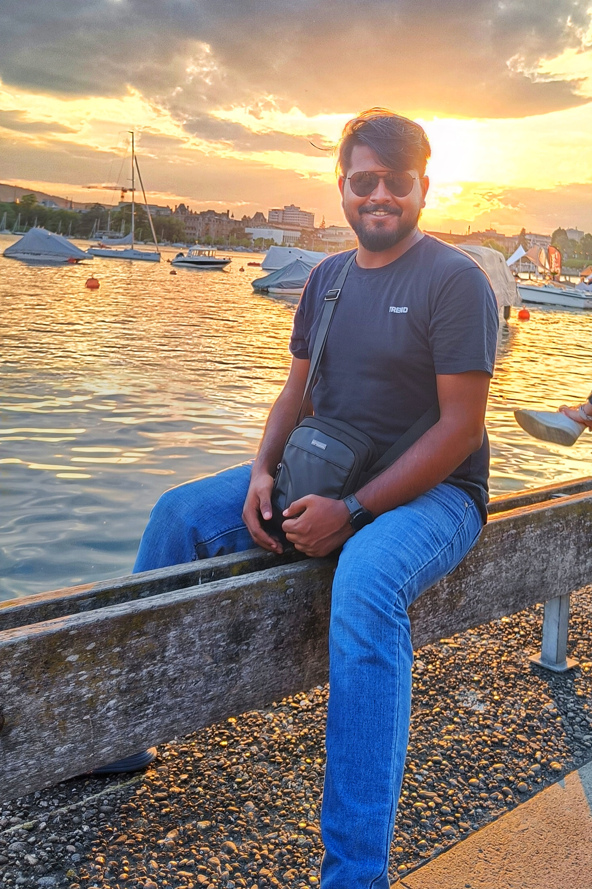

# Dhrubajyoti Biswas

### Hey guys,

 I am Dhrubajyoti, and I am currently a Ph.D scholar at the [Department of Physics](https://physics.iitm.ac.in), Indian Institute of Technology (IIT) Madras, Chennai. I work with [Dr. Vaibhav Madhok](https://sites.google.com/view/madhok) and [Dr. Sayan Gupta](https://home.iitm.ac.in/sayan/). My interests are in the area of complex networks and dynamical systems. I am also quite interested in applications of High Performance Computing (HPC) in physics simulations.

 I currently stay on campus at IIT Madras in Bhadra Hostel, while my native place is back in the wee town of [Kalyani](https://en.wikipedia.org/wiki/Kalyani,_West_Bengal), West Bengal. Apart from my academic interests, I am passionate about programming and photography (check out my [Instagram] and [Youtube]). I also play cricket from time to time.

 
## Education

| Year | Details |
| --- | --- |
| 2019 - now | Ph.D in Physics, IIT Madras   |
| 2017 - 2019 | M.Sc in Physics, IIT Madras  |
| 2014 - 2017 | B.Sc in Physics, St. Xavier's College Kolkata, University of Calcutta |

- My complete academic C.V is available [here](https://drive.google.com/file/d/1pDmqyZtTw7QiOCLzVDtpZioT9_SFtdWR/view?usp=sharing).

## Contacts and Links

*Email IDs.* dhrubajyoti98 [at] gmail.com (personal), smail.iitm.ac.in/physics.iitm.ac.in (work).

*Other Links.* [Google Scholar], [Github], [LinkedIn].

[Google Scholar]: https://scholar.google.com/citations?hl=en&view_op=list_works&alert_preview_top_rm=2&authuser=2&gmla=AJsN-F6rWGoE7sGF-2nr8CLDhXm_38Ftp_fxX0X6ieV4zVOmsXvQaDZkf6P2HSbFReOJ4TNweS9QakTMbQz0h0yQ-0dhqCcDUmkL28jKTIbk-G91L3hjPyE&user=2OR7h7kAAAAJ

[Github]: https://github.com/dhrubajyoti98
[LinkedIn]: https://www.linkedin.com/in/dhrubajyoti-biswas/
[Instagram]: https://www.instagram.com/pushhu/
[Youtube]: https://www.youtube.com/c/DhrubajyotiBiswas2k14