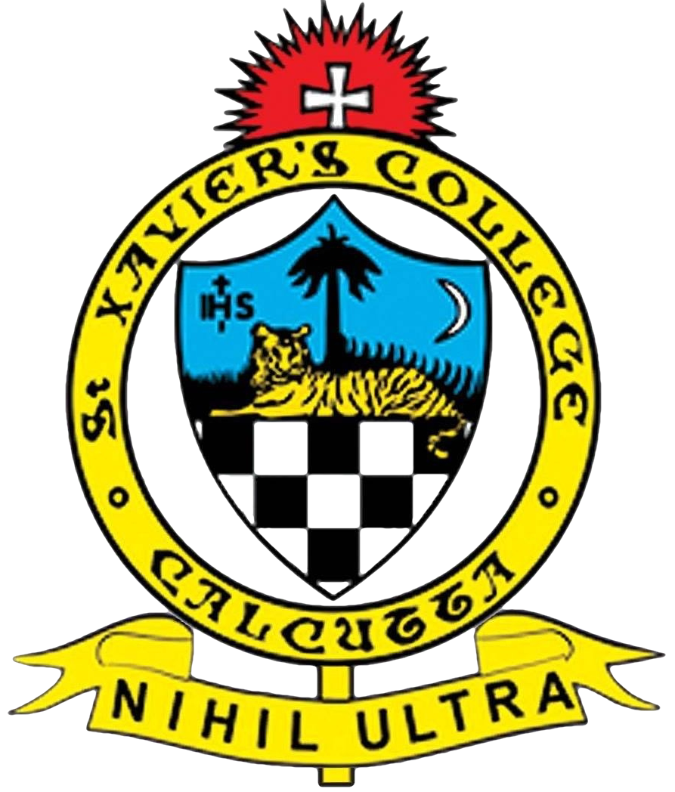

  <a class="active" href="index.html">Home</a>
  <a href="res_pub_conf.html">Research</a>
  <a href="teaching.html">Teaching</a>
  <a href="resources.html">Resources</a>

 

> "I have no special talent. I am only passionately curious." - Albert Einstein

### Hey guys,

I am Dhrubajyoti, and I am currently a Ph.D scholar at the [Department of Physics](https://physics.iitm.ac.in), Indian Institute of Technology (IIT) Madras, Chennai. I work with [Dr. Vaibhav Madhok](https://sites.google.com/view/madhok) and [Dr. Sayan Gupta](https://home.iitm.ac.in/sayan/). My interests are in the area of *complex networks* and *dynamical systems*. I am also quite interested in learning about applications of *high performance computing* and *parallel computing* using APIs like OpenMP, OpenACC etc., in physics simulations.

I currently stay on campus at IIT Madras in Bhadra Hostel, while my native place is back in the town of [Kalyani](https://en.wikipedia.org/wiki/Kalyani,_West_Bengal), West Bengal. Apart from my academic interests, I am passionate about programming and photography (check out my [<i class="fa fa-instagram fa-lg"></i>] and [<i class="fa fa-youtube fa-lg"></i>]). I also play cricket from time to time.

 
## Education

| Year | Details |
| --- | --- |
| 2019 - now | Ph.D in Physics, IIT Madras.   |
| 2017 - 2019 | M.Sc in Physics, IIT Madras.  |
| 2014 - 2017 | B.Sc in Physics, St. Xavier's College Kolkata, University of Calcutta. |

- My complete academic CV is available [here](https://drive.google.com/file/d/1pDmqyZtTw7QiOCLzVDtpZioT9_SFtdWR/view?usp=sharing).

## You can find me at ...

<iframe src="https://www.google.com/maps/embed?pb=!1m18!1m12!1m3!1d3887.712260357591!2d80.22853715033308!3d12.99024669079881!2m3!1f0!2f0!3f0!3m2!1i1024!2i768!4f13.1!3m3!1m2!1s0x3a52677fc2aa5e79%3A0x803f6dd62d082508!2sMechanical%20Sciences%20Block!5e0!3m2!1sen!2sin!4v1640867815849!5m2!1sen!2sin" width="200" height="175" style="float: right; border:0; padding-left: 10px; padding-bottom: 5px;" allowfullscreen="" loading="lazy"></iframe>

<link rel="stylesheet" href="https://cdnjs.cloudflare.com/ajax/libs/font-awesome/4.7.0/css/font-awesome.min.css">

***Links.*** [<i class="fa fa-google fa-lg"></i>-scholar], [<i class="fa fa-git fa-lg"></i>hub], [Linked<i class="fa fa-linkedin fa-lg"></i>] and [<i class="fa fa-facebook-f fa-lg"></i>acebook].

***Email IDs.*** dhrubajyoti98 [at] [gmail.com (personal email); smail.iitm.ac.in / physics.iitm.ac.in (IITM - work emails)].

***Office Address.*** MSB 108 *"The Uncertainty Lab"*, Mechanical Sciences Block, Indian Institute of Technology Madras, Chennai 600036.

[<i class="fa fa-google fa-lg"></i>-scholar]: https://scholar.google.com/citations?hl=en&view_op=list_works&alert_preview_top_rm=2&authuser=2&gmla=AJsN-F6rWGoE7sGF-2nr8CLDhXm_38Ftp_fxX0X6ieV4zVOmsXvQaDZkf6P2HSbFReOJ4TNweS9QakTMbQz0h0yQ-0dhqCcDUmkL28jKTIbk-G91L3hjPyE&user=2OR7h7kAAAAJ

[<i class="fa fa-git fa-lg"></i>hub]: https://github.com/dhrubajyoti98

[Linked<i class="fa fa-linkedin fa-lg"></i>]: https://www.linkedin.com/in/dhrubajyoti-biswas/

[<i class="fa fa-instagram fa-lg"></i>]: https://www.instagram.com/pushhu/

[<i class="fa fa-youtube fa-lg"></i>]: https://www.youtube.com/c/DhrubajyotiBiswas2k14

[<i class="fa fa-facebook-f fa-lg"></i>acebook]: https://www.facebook.com/dhrubajyoti.biswas1/