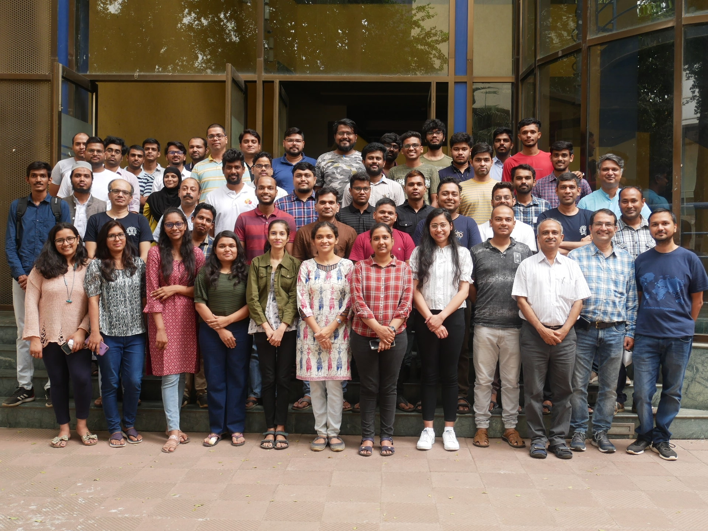
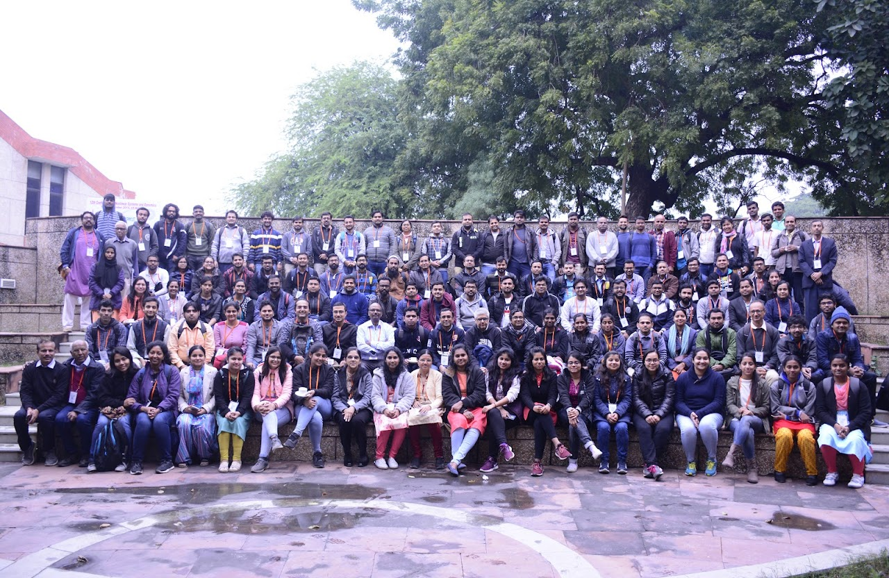
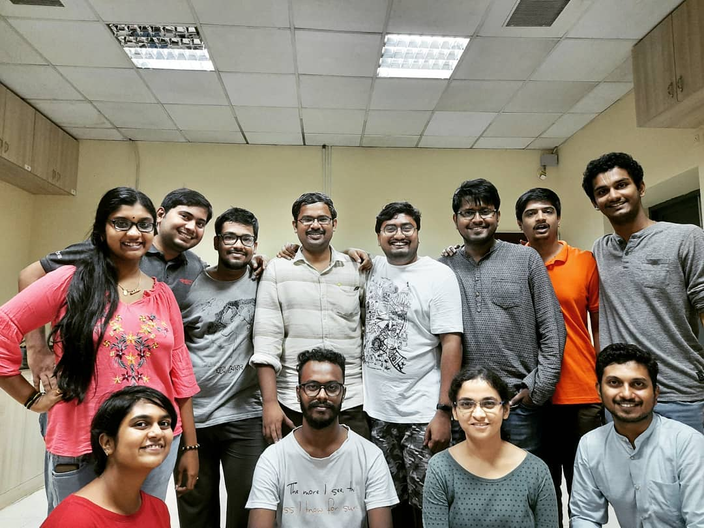
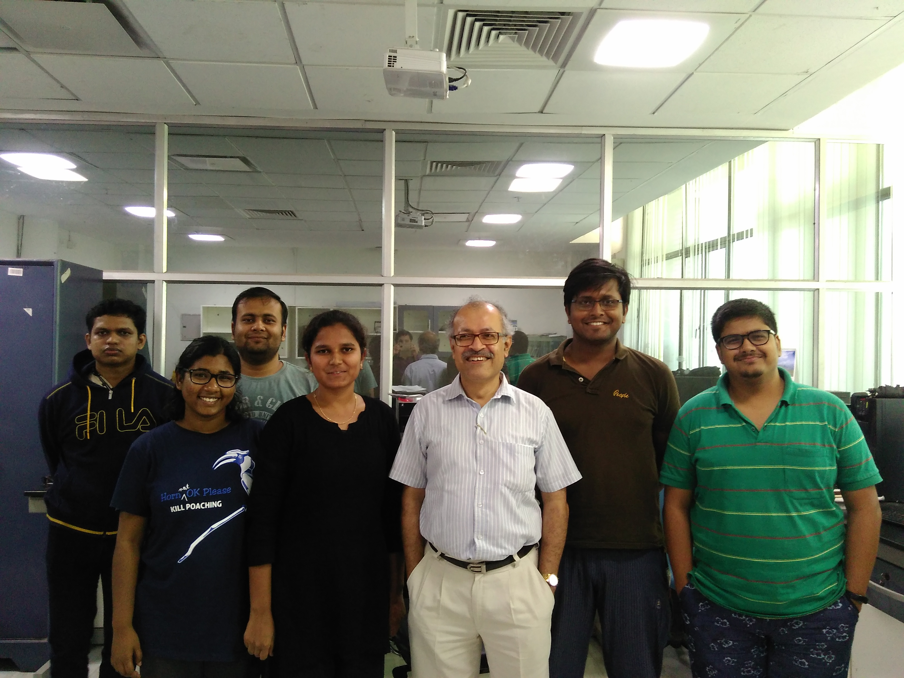
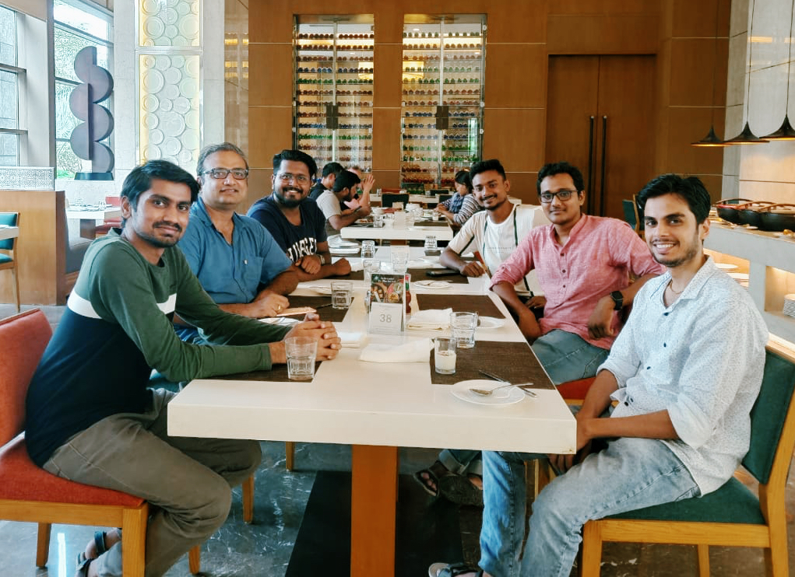

  <a href="index.html">Home</a>
  <a href="res_pub_conf.html">Research</a>
  <a href="teaching.html">Teaching</a>
  <a class="active" href="misc.html">Misc.</a>

 

> 
 
 “It doesn’t matter how beautiful your theory is, it doesn’t matter how smart you are. If it doesn't agree with experiment, it’s wrong.” - Richard Feynman 
 

### Some Pictures

  
  
NSM Workshop on HPC@IIT Bombay

  
  
CNSD 2019@IIT Kanpur

  
  
TUBML Group@IIT Madras, 2019

  
  
With Prof. Soumitro Banerjee@IISER-K

  
  
TUBML Group Outing, 2022

  
  
Prof. Madhok's Group, 2022

  
  
Epidemic Modeling Symp. 2022

 

<h3>Random Things</h3>

<ol>
<li><a href="https://dashing-kiwi-f01.notion.site/Random-stuff-I-find-extremely-interesting-and-or-useful-bdf4d7b424a440beac9458d986d56aac)">Random stuff I find extremely interesting and/or useful</a>.</li>

<li><a href="https://www.gnu.org/software/gsl/doc/html/index.html">GNU Scientific Library (GSL)</a> - a very important numerical C/C++ library.</li>
  
<li>A benchmark suite for workstations - see <a href="https://github.com/dhrubajyoti98/HPPWB">here</a>.</li>

<li>The definitive OpenMP resource : <a href="https://youtube.com/playlist?list=PLLX-Q6B8xqZ8n8bwjGdzBJ25X2utwnoEG">"A Hands-On Introduction to OpenMP"</a>.</li>
  
<li>A collection of OpenACC resources : <a href="https://drive.google.com/drive/folders/12oNwTvN4Dns6pTldCJArB1tQn7AuBwQM?usp=sharing">[OpenACC slides]</a>.</li>

</ol>

